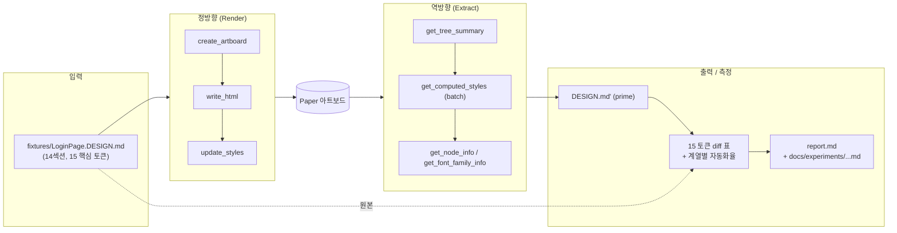

# Implementation Plan: spec-4-02

## 📋 Branch Strategy

- 신규 브랜치: `spec-4-02-paper-mcp-roundtrip`
- 시작 지점: **`phase-4-collab-flow`** (phase base branch)
- PR 타겟: `phase-4-collab-flow`
- 첫 task 가 브랜치 생성을 수행함

## 🛑 사용자 검토 필요 (User Review Required)

> [!IMPORTANT]
> - [ ] **Paper 작업 위치** — 본 PoC 는 사용자의 Paper 파일에 실제 아트보드를 생성한다. 작업용 격리 위치 지정 필요. 기본 제안: "새 페이지 `phase-4-spec-4-02-poc` 를 생성하고 그 안에 아트보드 배치 → 작업 종료 후 `finish_working_on_nodes` 로 마킹, 물리적 삭제는 사용자 판단". 다른 위치로 원하면 Plan Accept 전 지정.
> - [ ] **정확도 기준** — 색상 ≥90% / 타이포 ≥85% / 간격 ≥75% / 그림자 ≥70% (계열별 차등). phase-4.md 원안은 단일 80%. 차등 기준 채택 여부.
> - [ ] **15 토큰 목록** — 하단 §측정 토큰 표 확인. 더하거나 뺄 항목 있으면 지정.

> [!WARNING]
> - [ ] **실제 MCP 호출 발생** — Plan Accept 이후 Task 3 / 4 는 사용자의 Paper 환경에 쓰기 작업을 수행한다. 취소 시점은 Task 3 시작 직전.
> - [ ] **Paper MCP 도구 한계 발견 시 처리** — 도구 커버리지 갭 (RQ5) 발견 시 Hard Stop + 재얼라인. Trade-off 분석의 근거가 되므로 버리지 않음.

## 🎯 핵심 전략 (Core Strategy)

### 아키텍처 컨텍스트

### 주요 결정

| 컴포넌트 | 전략 | 이유 |
|:---:|:---|:---|
| **실행 주체** | AI Agent direct (MCP 호출, 스크립트 없음) | spec-4-01 프로토콜은 AI 를 1 급 역할로 정의. PoC 도 동일 방식으로 수행해야 프로토콜 일관성 |
| **픽스처 소스** | `e2e-demo-loginpage.md` 의 LoginPage 명세를 구조화 재구성 | 이미 검증된 소스. 신규 작성 대비 노이즈 0 |
| **정확도 기준** | 계열별 차등 (색상/타이포/간격/그림자) | 토큰 계열별 자동화 난이도가 체계적으로 다름 — 단일 임계치는 과/약평가 |
| **측정 토큰 수** | 핵심 15 개 | tokens.json 전체 60~80 개는 PoC 범위 초과. LoginPage 화면에서 실제 시각 영향 큰 것만 선별 |
| **산출물 2 파일** | `report.md` (결론) + `docs/experiments/...md` (증거 로그) | Research DoD 의 "Prototype + Recommendation" 분리. 미래 감사 가능 |
| **Prototype 격리** | 별도 페이지 `phase-4-spec-4-02-poc` 에 아트보드 | 사용자 Paper 의 기존 작업 비파괴 |
| **실패 허용** | "실패도 연구 결과" — 도구 한계 발견 시 RQ5 증거로 기록 | Research spec 의 본질. Go/No-Go 에는 No-Go 도 유효한 결론 |

### 측정 토큰 (15)

| # | 계열 | 토큰 / DESIGN.md 필드 | 참조 |
|---|:---:|---|---|
| 1 | color | `--primary` (oklch 0.205 0 0) | Button bg |
| 2 | color | `--primary-foreground` (oklch 0.985 0 0) | Button text |
| 3 | color | `--card` (#ffffff) | Card bg |
| 4 | color | `--border` (oklch 0.922 0 0) | Card / Input border |
| 5 | color | `--muted-foreground` (oklch 0.556 0 0) | Description / placeholder |
| 6 | color | `--foreground` (oklch 0.145 0 0) | Heading |
| 7 | typography | font-family primary | Body / Heading |
| 8 | typography | font-size 14px (text-sm) | Label / Button |
| 9 | typography | font-size 24px (text-2xl) | Title |
| 10 | typography | font-weight 500 / 600 | Label / Title |
| 11 | spacing | padding 32px (p-8) | Card |
| 12 | spacing | gap 16px (space-y-4) | Form rows |
| 13 | radius | 5px (--radius-md) | Input / Button |
| 14 | radius | 8.75px (--radius-xl) | Card |
| 15 | shadow | 0 1px 3px rgba(0,0,0,0.1) | Card |

## 📂 Proposed Changes

### [NEW] `specs/spec-4-02-paper-mcp-roundtrip/fixtures/LoginPage.DESIGN.md`

e2e-demo-loginpage.md §실험설계 를 14 섹션 구조로 재작성 — Paper 에 입력할 명세.

### [NEW] `specs/spec-4-02-paper-mcp-roundtrip/report.md`

Research 최종 보고서. 구성:
- 결론 요약 (Go/No-Go, 한 줄)
- Trade-off 분석 (정방향 vs 역방향)
- 자동화 경계 (어디까지 자동, 어디부터 수동)
- RQ1~RQ5 답변
- MCP 도구 커버리지 갭
- 후속 spec 권장사항 (SignupPage/Dashboard 확장 또는 Figma)

### [NEW] `docs/experiments/paper-roundtrip-2026-04-22.md`

실행 로그. 구성:
- 환경 (Paper file name, MCP version 확인)
- 각 Task 의 MCP 호출 명령 + 입력 + 출력 raw
- 15 토큰 diff 표 (field × {원본, Paper observed, extracted, 일치여부})
- 계열별 자동화율 계산
- 관측된 이슈 / 우회 방법

### [MODIFY] `docs/guides/collaboration-flow.md` (조건부)

Stage 2 / Stage 5 Done 기준에 실전 관측 사항 반영. **조건부**: PoC 결과가 기존 Done 기준과 다를 경우에만 수정. 같으면 생략.

### 변경하지 않는 것

- `templates/*` / `schema/*` — 기존 스키마/템플릿 미변경
- Paper 의 기존 기타 페이지 / 아트보드
- `backlog/phase-4.md` 본 spec 방향성 문단 — 수정 없음

## 🧪 검증 계획 (Verification Plan)

### 단위 테스트

Research spec — 전통적 단위 테스트 없음.

### 통합 테스트 (Integration Test Required = yes)

**phase-4.md 통합 시나리오 1 (Paper 왕복)**:
- Given: LoginPage DESIGN.md 픽스처
- When: 정방향 + 역방향 1 사이클 실행
- Then: 15 토큰 중 12 개 (80%) 이상 일치 OR 계열별 차등 기준 모두 통과

### 수동 검증 시나리오

1. **Re-run 가능성 체크** — walkthrough 만으로 동일 환경에서 재실행 가능한가?
2. **픽스처 정합성** — `fixtures/LoginPage.DESIGN.md` 의 토큰 값이 Phase 2 LoginPage 실제 구현 CSS 와 일치하는가?
3. **자동화율 수치 검증** — diff 표의 match 수 = 계산된 % 와 일치
4. **Go/No-Go 판정 근거** — report.md 결론이 RQ1~RQ5 답변에서 논리적으로 도출되는가?

## 🔁 Rollback Plan

- Paper 아트보드: `finish_working_on_nodes` 후 남겨두거나 사용자 판단 삭제
- Git: 브랜치 포기 시 `git checkout phase-4-collab-flow && git branch -D spec-4-02-paper-mcp-roundtrip`
- 새 파일만 추가되므로 Paper 환경 외 사이드 이펙트 없음

## 📦 Deliverables 체크

- [x] spec.md 작성
- [x] plan.md 작성 (이 파일)
- [ ] task.md 작성 (다음 단계)
- [ ] 사용자 Plan Accept
- [ ] (실행 후) 모든 task 완료
- [ ] (실행 후) walkthrough.md / pr_description.md ship
