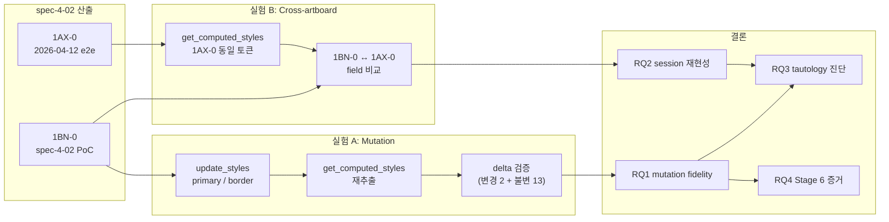

# Implementation Plan: spec-4-03

## 📋 Branch Strategy

- 신규 브랜치: `spec-4-03-paper-roundtrip-rigor`
- 시작 지점: **`phase-4-collab-flow`** (phase base branch)
- PR 타겟: `phase-4-collab-flow`
- 본 spec 머지 시 PR #18 (phase-4 ship) 이 자동 업데이트 → 재오픈하여 Ship 재시도

## 🛑 사용자 검토 필요

> [!IMPORTANT]
> - [ ] **Mutation 대상 2 토큰**: `--primary` (`#171717` → `#D01A3F` 빨강) + `--border` (`#E5E5E5` → `#999999` 중간 회색). 시각적 차이가 크고 역추출에서 구별 용이한 값. 다른 조합 선호 시 지정.
> - [ ] **`1BN-0` 원복 필수 여부**: 기본은 "복구 후 보존" (다음 번 참고용). 아트보드 완전 삭제 원하면 지정.
> - [ ] **spec-4-02 의 "100% PASS" 판정 철회 범위**: 본 spec 결과를 "spec-4-02 의 한계 보완" 으로 위치 지울지, 아니면 "spec-4-02 결과 일부 무효화" 까지 갈지.

> [!WARNING]
> - [ ] **실제 Paper 쓰기 재발생** — Task 2 는 `update_styles` 로 `1BN-0` 에 쓰기. Task 5 에서 원복.
> - [ ] **Cross-artboard 실험은 읽기만** — `1AX-0` 변경 0.

## 🎯 핵심 전략

### 아키텍처

### 주요 결정

| 컴포넌트 | 전략 | 이유 |
|:---:|:---|:---|
| 실험 대상 토큰 2 개 | `--primary` + `--border` | 각각 다른 계열 (색상 / neutral) + 시각 분별력 + 여러 노드에서 쓰임 (불변 검증 풍부) |
| mutation 값 선정 | Paper 렌더에서 육안으로도 구별 가능 | 디버깅 용이 |
| 원복 방식 | 원본 값으로 `update_styles` 재호출 | Paper MCP 에 "snapshot/restore" 가 없으므로 수동 원복 |
| 1AX-0 변경 금지 | 엄격 | 2026-04-12 증거 보존 — 수정 시 비교 기준 상실 |
| 재검증 범위 | **15 토큰 그대로** | spec-4-02 와 동일 스코프 — 결과 대조 가능성 보존 |
| 결론 서술 방식 | "PASS/FAIL + 단서" | 회고에서 지적된 "단서 삭제 결론" 문제 재발 방지 |

### 실험 A 상세

**대상**: `1BN-0 Card > LoginForm > SubmitButton (1C1-0)` + `1BN-0 Card > EmailField > Input (1BV-0) border`

**실행 순서**:
1. Mutation 전 baseline 재확인 — `get_computed_styles(["1C1-0", "1BV-0"])` 현재 값 기록
2. `update_styles([{nodeIds:["1C1-0"], styles:{backgroundColor:"#D01A3F"}}, {nodeIds:["1BV-0","1BZ-0","1C8-0","1CA-0","1CC-0"], styles:{borderColor:"#999999"}}])` — border 는 5 개 노드 일괄 (Card 제외 모든 border 사용처)
3. 즉시 `get_computed_styles` 15 토큰 대응 9 노드 재추출
4. 결과 표:
   - 변경 의도한 2 토큰 → 새 값 일치 검증
   - 변경 안 한 13 토큰 → 기존 값과 exact match 검증
5. 원복: `update_styles` 로 원본 값 (`#171717`, `#E5E5E5`) 재적용
6. 원복 후 재추출해 원본 복구 확인
7. `get_screenshot(1BO-0)` 으로 시각 복원 증거

**판정 기준**:
- Mutation 의도 2 토큰 새 값 일치 — FAIL 시 "Paper 가 쓰기 요청을 정확히 저장하지 않음" (treaty 적 문제)
- 불변 13 토큰 — FAIL 시 "부분 업데이트가 주변 토큰 오염" (Stage 6 의 본질적 위험)

### 실험 B 상세

**대상**: `1AX-0` (2026-04-12 생성, LoginPage 구조 동등 가정)

**실행 순서**:
1. `get_tree_summary(1AX-0, depth=3)` — 구조 확인. spec-4-02 `1BN-0` 와 노드 배치 유사성 점검.
2. `get_computed_styles` 로 Card / Input / Button / 주요 Text 노드 추출.
3. 15 토큰 중 추출 가능한 필드만 대조표 작성 (노드 구조가 다를 수 있으므로 subset).
4. 결론: 동일 shadcn-baseline 의 두 독립 Paper 저장값이 exact match 인지, 차이 있으면 원인 (다른 의사결정 / 다른 MCP 버전 등) 가설.

**주의**: `1AX-0` 가 정확히 같은 shadcn 토큰으로 만들어졌는지 사전 보장 없음. 차이 발견 시 "양쪽이 독립적으로 만든 결과의 자연스러운 divergence" 로 해석. 이 자체가 RQ2 의 의미 있는 답.

## 📂 Proposed Changes

### [NEW] `docs/experiments/paper-roundtrip-rigor-2026-04-22.md`
실험 A/B 실행 로그 + 결론.

### [NEW] `specs/spec-4-03-paper-roundtrip-rigor/report.md`
Research 보고서:
- 결론 한 줄 (spec-4-02 결과 재해석)
- RQ1~RQ4 답변
- tautology 진단의 최종 결론
- Stage 6 Iterate 증거 평가
- phase-4.md 결론 재작성 제안

### [MODIFY] `backlog/phase-4.md`
- §검증 결과 전면 재작성 — "15/15 100% match" → "표기 정규화 범위 내에서 안정 저장, 진짜 왕복 가설은 spec-4-03 에서 조건부 검증" 로 다운그레이드
- 실측/미실측 단계 명확히 표기
- spec-4-03 결과 링크

### [MODIFY] `backlog/phase-5.md`
`spec-5-001` 방향성 문단의 "왕복 100% 유지되는가" 표현 → "왕복 drift 측정" 으로 완화.

### [MODIFY] `backlog/phase-7.md`
`spec-7-004` 방향성 문단의 "자동 정규화 패턴을 Figma 에도 동일하게 적용 가능한지 검증" 표현 → "Paper 에서 관찰된 표기 정규화 패턴 (값 보존 ≠ 의도 보존) 의 Figma 재적용성 검증" 로 구체화.

### [MODIFY] `docs/guides/collaboration-flow.md`
- Stage 2 hook-paper-extract 앵커: "spec-4-02 검증 **완료 (2026-04-22)** 100% (15/15)" → "spec-4-02 + spec-4-03 검증 **완료** — 표기 정규화 범위에서 안정, tautology 해소는 spec-4-03 참조"
- Stage 5 hook-paper-render 앵커: 동일 형식 업데이트

### [MODIFY] `backlog/queue.md` Icebox
- 기존 3 항 유지
- 추가: **W4 거버넌스 부채** — spec-4-02 의 Task 4+5 통합 commit (`2242e89`) 이 One Task = One Commit (constitution §8) 을 위반. 재발 방지 메모 + retrospective 링크.
- 추가: **C4 phase-ship.md 템플릿 부재** — harness-kit 0.5.0 의 `.harness-kit/agent/templates/` 에 `phase-ship.md` 누락. upstream 기여 대상.

## 🧪 검증 계획

### 단위 테스트
Research spec — 없음.

### 통합 테스트 (Integration Test Required = yes)

phase-4.md 통합 시나리오 1 (Paper 왕복) 을 **재수행** — spec-4-02 의 같은 시나리오를 rigor 버전으로 재실행.

### 수동 검증 시나리오
1. 실험 A 의 mutation 이 실제로 Paper 에서 색이 바뀐 것을 스크린샷으로 확인
2. 원복 후 스크린샷이 spec-4-02 최종 스크린샷과 시각적으로 동일
3. 실험 B 결과 표에서 다른 아트보드라도 같은 hex 로 저장되는지 (또는 차이가 "자연스러운 divergence" 로 설명되는지)
4. phase-4.md / phase-5.md / phase-7.md 수정본을 읽었을 때 "단서 없는 100% 주장" 이 제거됐는지 인지 테스트

## 🔁 Rollback Plan

- Paper 측: 실험 A 원복 실패 시 수동으로 `1BN-0` 재생성 (spec-4-02 Task 3 절차 반복). 5 분.
- Git 측: 본 branch 폐기 시 `git branch -D spec-4-03-paper-roundtrip-rigor`. PR #18 Draft 상태는 유지되므로 영향 없음.
- 문서 롤백: 수정 대상 4 파일의 이전 커밋 (`0ad306d` 이전) 참조.

## 📦 Deliverables 체크

- [x] spec.md 작성
- [x] plan.md 작성 (이 파일)
- [ ] task.md 작성 (다음 단계)
- [ ] 사용자 Plan Accept
