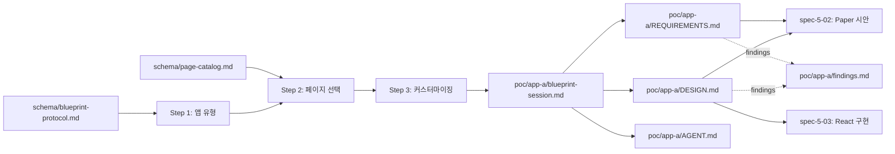

# spec-5-01: 앱 A Blueprint 응답 및 정의 산출물

## 📋 메타

| 항목 | 값 |
|---|---|
| **Spec ID** | `spec-5-01` |
| **Phase** | `phase-5` |
| **Branch** | `spec-5-01-app-a-blueprint` |
| **상태** | Planning |
| **타입** | Feature (PoC) |
| **Integration Test Required** | no (Phase 통합 테스트 시나리오 1 의 첫 단계) |
| **작성일** | 2026-04-26 |
| **소유자** | Dennis |

## 📋 배경 및 문제 정의

### 현재 상황

- Phase 1~3 으로 Foundation, Page Template, Blueprint 질의서 / Page 카탈로그 / 템플릿 세트 (`templates/{REQUIREMENTS,DESIGN,AGENT}.md.template`) 가 모두 갖추어졌다.
- Phase 4 에서 협업 Flow 프로토콜 + Paper MCP 왕복 실험 (LoginPage 기준) 을 마쳤다.
- 그러나 **실제 앱을 처음부터 끝까지 정의해 본 경험은 없다**. 즉 "Blueprint → REQUIREMENTS → DESIGN" 파이프라인이 빈 상태에서 가동되는지 검증되지 않았다.

### 문제점

- Blueprint 프로토콜 (3 단계 질의) 이 실전에서 어떤 누락 / 모호성을 드러내는지 측정된 적 없다.
- REQUIREMENTS.md 템플릿의 placeholder (`{{...}}`) 가 실제 앱 정의에 충분한가, 부족한 항목이 있는가 미검증.
- DESIGN.md 가 "토큰 / i18n / state / variant" 를 모두 담을 만큼 표현력이 있는지 실증 미수행.
- 후속 spec-5-02 (Paper 시안), spec-5-03 (React 구현) 이 의존하는 **신뢰할 수 있는 상위 산출물이 없다**.

### 해결 방안 (요약)

샘플 SaaS 앱 1 개를 정해 Blueprint 질의서를 실제로 실행하고, REQUIREMENTS.md / DESIGN.md / AGENT.md 3 종 산출물을 작성한다. 작성 과정에서 발견한 템플릿 / 스키마 / 프로토콜의 한계를 `findings.md` 에 기록하여 phase-5 회고 (spec-5-05) 와 Studio v1 요구사항 (phase-6) 의 입력으로 사용한다.

## 📊 개념도

## 🎯 요구사항

### 앱 A 컨셉 (제안 — 사용자 확정 필요)

| 항목 | 값 (제안) |
|---|---|
| **앱 이름** | TaskFlow |
| **앱 slug** | `taskflow` |
| **앱 유형** | SaaS (B2B 협업 도구) |
| **핵심 가치** | 작은 팀의 작업 / 일정 관리, 1 인 PM 도 운영 가능 |
| **타겟 언어** | en (앱 B 에서 한국어로 교체) |
| **브랜드 포지션** | 차분한 인디고 + 청록 액센트, 본문 sans-serif |

### Functional Requirements

1. **Blueprint 세션 기록 (`poc/app-a/blueprint-session.md`)**
   - Step 1 (앱 유형) / Step 2 (페이지 선택) / Step 3 (커스터마이징) 의 질문, 응답, 결정 근거 기록
   - 응답 YAML 블록을 protocol 문서의 출력 형식과 일치
2. **REQUIREMENTS.md 작성 (`poc/app-a/REQUIREMENTS.md`)**
   - `templates/REQUIREMENTS.md.template` placeholder 를 모두 실제 값으로 치환
   - 페이지 5 종 이상 포함 (LoginPage / SignupPage / DashboardPage / MyPage / NotFoundPage 권장)
   - 각 페이지의 variant + 필수 / 선택 섹션 명시
3. **DESIGN.md 작성 (`poc/app-a/DESIGN.md`)**
   - `schema/design-md-schema.md` 의 구조를 따름
   - 토큰 (color / typography / spacing / radius) + i18n 키 (en) + 페이지별 state 정의
4. **AGENT.md 작성 (`poc/app-a/AGENT.md`)**
   - `templates/AGENT.md.template` 활용. 후속 spec-5-02 / 5-03 에서 AI 에이전트가 참조할 운영 규약
5. **Findings 기록 (`poc/app-a/findings.md`)**
   - 작성 중 발견한 Blueprint 프로토콜 / 템플릿 / 스키마 결함 또는 모호성을 항목별로 기록
   - 각 항목에 분류 태그 (`gap` / `ambiguity` / `over-spec` / `placeholder-mismatch`)

### Non-Functional Requirements

1. 모든 산출물은 한국어 (코드 / 식별자 / 스키마 키는 영어 허용).
2. Page ID 는 `schema/page-catalog.md` 의 ID 를 그대로 사용 — 신규 ID 도입 금지 (도입 필요 시 findings 에 기록하고 본 spec 범위 밖으로 이관).
3. 산출물 4 종 (`blueprint-session.md`, `REQUIREMENTS.md`, `DESIGN.md`, `AGENT.md`) 은 **상호 일관**해야 한다 — 같은 페이지 / 토큰 / i18n 키가 서로 다르게 표기되면 안 됨.

## 🚫 Out of Scope

- Paper 디자인 시안 생성 → spec-5-02
- React 코드 구현 → spec-5-03
- 앱 B (재사용성 검증) → spec-5-04
- Phase 4 이월 검증 (원본 의도 보존, variant drift, 상호작용 state) → spec-5-02 / 5-03
- 템플릿 (`templates/*.template`) 자체 수정 — 결함은 findings 에 기록만, 수정은 phase-5 회고 또는 phase-6 에서 일괄 처리

## 🔍 Critique 결과 (선택)

미실행. Phase 4 회고 (A4) 에서 critique 미실행이 부채로 등재됨. 본 spec 은 내용 자체가 검증 PoC 이므로 critique 효용이 낮다고 판단 — 대신 **자기검증 체크리스트** 를 task 마지막에 포함.

## ✅ Definition of Done

- [ ] `poc/app-a/blueprint-session.md` 작성 (Step 1~3 + 출력 YAML)
- [ ] `poc/app-a/REQUIREMENTS.md` 작성 (placeholder 0 잔존)
- [ ] `poc/app-a/DESIGN.md` 작성 (스키마 준수)
- [ ] `poc/app-a/AGENT.md` 작성
- [ ] `poc/app-a/findings.md` 작성 (최소 3 항목)
- [ ] 자기검증 체크리스트 PASS (4 종 산출물 상호 일관성 + Page ID 카탈로그 일치)
- [ ] `walkthrough.md` + `pr_description.md` 작성 및 ship commit
- [ ] `spec-5-01-app-a-blueprint` 브랜치 push 완료
- [ ] 사용자 검토 요청 알림 완료
